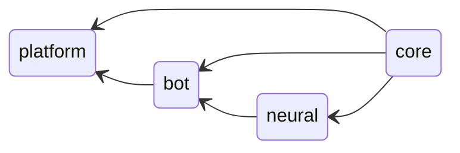

# `Project structure`

[< Return to the main readme][docs_main_readme]

## The project consists of the following parts:

|     Part     |                                      Description                                       |
|          --: |                                          :--                                           |
|       `core` | The basic stuff which is common for every program aka resource management or constants |
|        `bot` | The bot behavior itself, which is independent from actual api like telegram or discord |
|     `neural` | The primitive neural network implementation as a tool-set for bot                      |
|   `platform` | Just a platform specific sources and an OSs' entry instruction                         |

## The scheme of dependencies looks like:

[docs_main_readme]: ./../README.md
